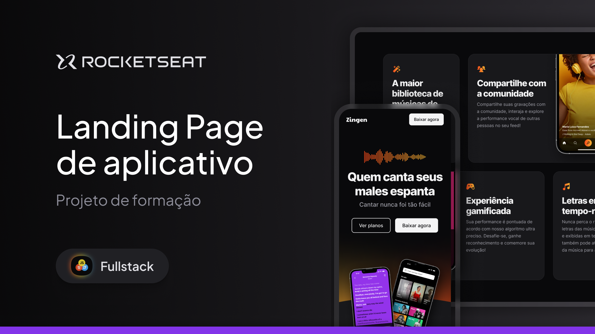

# Zingen app de música

>Full-Stack - Projeto Zingen, app de música

Mais um desafio de Layout com CSS do curso Full-Stack da Rocketseat, desta vez um desafeio para um layout responsívo e para versão mobile também

## 👨‍💻 Tecnologia

- HTML
- CSS
- Git e Github

# 💭 O que aprendi?

Neste projeto o intuito era aprender usar as inúmeras formas de forms que se pode usar no HTML e estilizar no CSS, usamos input de data, Radio, Input de texto, Input de arquivo, usamos hover, botões, select com algumas opções entre outras coisas, usamos tambem Display Flex, e também o grid. Também foi usado o conceito de Media Queries, e mobile first, para que inicialmente a estilização seja feita em uma plataforma com dimenções menores, e depois iriamos editando para telas maiores.

## 📚 Contato

- e-mail: lucas.primati@hotmail.com
- github: [🔗 github](https://github.com/luprime)
- Linkdedl: [🔗 Linkedln](https://www.linkedin.com/in/lucas-primati/)